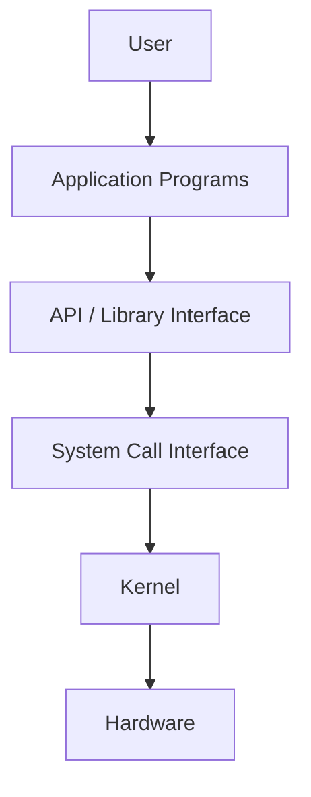
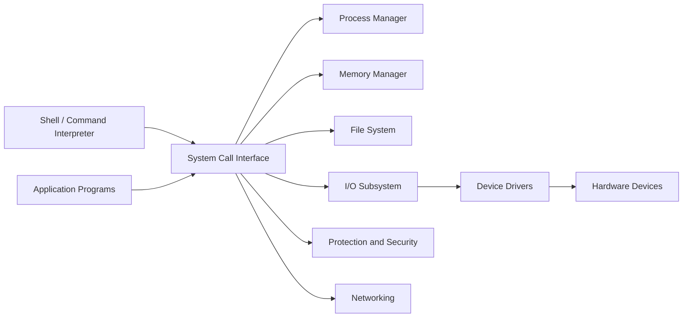
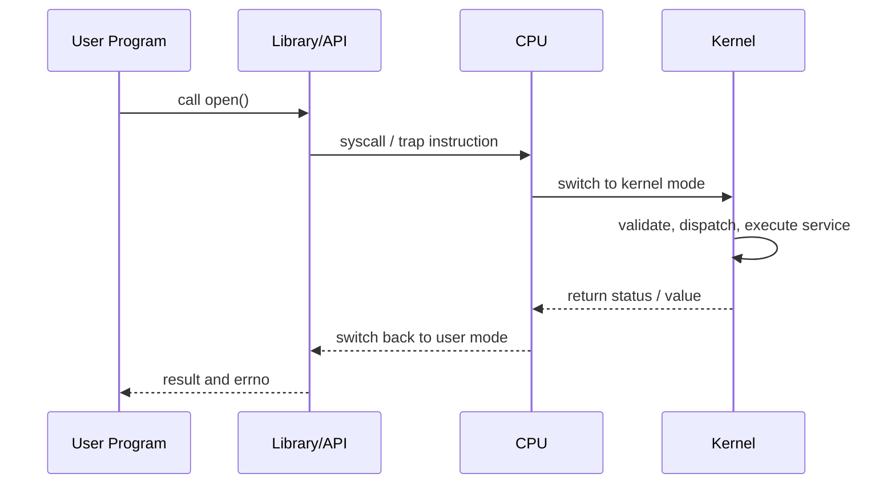

# CSTE 3103: Operating Systems and System Programming
## Week 01 Master Notes: Introduction to Operating Systems

> **Coverage Statement:** This note covers the full official Week 1 syllabus: What is an Operating System, Mainframe Systems, Desktop Systems, Multiprocessor Systems, Distributed Systems, Clustered Systems, Real-Time Systems, System Components, OS Services, System Calls, System Programs, and System Design and Implementation.
>
> **Goal:** Build understanding from zero to advanced, while staying directly useful for class tests, viva, assignments, and final exam answers.
>
> **Exam Strategy:** Learn the concept, then the comparison, then the exam-ready wording.

## 1. How to Use This Note

- **Core:** Must-know material for marks and conceptual safety.
- **Exam Alert:** A place where students usually gain or lose marks.
- **Advanced Insight:** Extra depth that strengthens understanding without leaving Week 1.
- **Bangla Hint:** Short memory aid in Bangla for fast recall.
- **Common Mistake:** A misconception that often causes wrong answers.
- **Quick Recall:** A compressed version for revision.

> **Bangla Hint:** Ei note-ta 3 layer-e poro: first pass for understanding, second pass for exam wording, third pass for tables and recall.

## 2. Week 1 Learning Outcomes

By the end of this note, you should be able to:

1. Define an operating system from user, system, and exam viewpoints.
2. Explain why an operating system is needed between applications and hardware.
3. Distinguish among mainframe, desktop, multiprocessor, distributed, clustered, and real-time systems.
4. Identify the major components of an operating system and state what each component does.
5. Explain standard OS services and connect each service to user needs and system needs.
6. Describe what a system call is and how control moves from user mode to kernel mode.
7. Differentiate among API calls, system calls, and system programs.
8. Explain the purpose of system programs such as shells, loaders, compilers, editors, and daemons.
9. Compare common OS design approaches such as monolithic, layered, microkernel, module-based, and hybrid designs.
10. Write short, medium, and long exam answers on Week 1 topics using precise terminology.

## 3. Big Picture Before the Details

Imagine a computer with no operating system.

- Every program would need to know how to talk to every hardware device directly.
- Two programs could try to use the CPU, memory, or disk at the same time with no central control.
- There would be no standard way to open files, run programs, communicate, or protect data.

An operating system exists to solve this chaos.

At the highest level, an operating system is:

- a **resource manager** that allocates CPU time, memory, storage, and I/O devices;
- a **control program** that supervises execution and prevents errors or misuse;
- an **abstraction provider** that hides low-level hardware complexity behind easier interfaces.

### 3.1 Why the OS Matters

Without the OS, computing would be:

- harder to program,
- less secure,
- less efficient,
- less reliable,
- far less portable.

With the OS, programmers can think in terms of:

- files instead of raw disk sectors,
- processes instead of bare CPU state,
- virtual memory instead of only physical RAM,
- sockets and pipes instead of electrical signals,
- permissions and users instead of unrestricted access.

> **Core:** The operating system sits between applications/users and hardware.

> **Exam Alert:** A very strong answer always mentions both sides:
> 1. The OS makes the system convenient for users and programmers.
> 2. The OS manages resources efficiently and safely for the computer system.

### 3.2 Two Classic Views of an OS

| View | Meaning | Why It Matters |
| --- | --- | --- |
| User view | The OS makes the computer easy to use. | Focuses on convenience, responsiveness, user interface. |
| System view | The OS manages hardware resources and controls execution. | Focuses on efficiency, fairness, protection, accounting. |

> **Bangla Hint:** User view = "comfort"; system view = "control".

## 4. What Is an Operating System?

### 4.1 Zero-Level Intuition

An operating system is the master software that starts after booting and stays active to coordinate all other programs and hardware activities.

If the computer were a city:

- hardware would be the physical roads, buildings, electricity, and machines;
- applications would be the people and businesses using the city;
- the operating system would be the administration, traffic control, utility management, and law enforcement.

### 4.2 Exam-Ready Definition

**Definition:** An operating system is system software that acts as an intermediary between users/applications and computer hardware, managing resources and providing common services for program execution.

This definition is strong because it contains three keywords:

- **intermediary**
- **resource management**
- **services**

### 4.3 Formal Functional Meaning

An operating system performs at least these responsibilities:

1. Process management
2. Memory management
3. File and storage management
4. I/O device management
5. Protection and security
6. Error detection and recovery support
7. Communication support
8. Accounting and monitoring

### 4.4 Major Goals of an Operating System

| Goal | Meaning | Example |
| --- | --- | --- |
| Convenience | Make the system easier to use | Opening a file with one command instead of issuing disk instructions |
| Efficiency | Use hardware resources well | CPU scheduling, memory allocation |
| Fairness | Share resources among programs/users | Time-sharing among multiple users |
| Reliability | Continue correct operation | Error handling, fault isolation |
| Protection | Prevent improper access | User permissions, memory protection |
| Extensibility | Support growth and new features | Modules, drivers, system updates |

### 4.5 Evolution in One Short Story

Operating systems did not appear fully formed. They evolved as computer use changed:

- **No OS / Manual operation:** One job at a time, direct human setup.
- **Batch systems:** Jobs grouped and executed automatically.
- **Multiprogramming:** Several jobs kept in memory to improve CPU utilization.
- **Time-sharing systems:** Interactive multi-user computing.
- **Personal computer systems:** Focus on convenience and interactivity.
- **Networked and distributed environments:** Cooperation among multiple machines.
- **Real-time and embedded systems:** Predictable response within deadlines.

> **Advanced Insight:** A change in OS design often follows a change in hardware economics. As CPUs, memory, and networks became cheaper and faster, OS priorities shifted from simple execution to scalability, responsiveness, isolation, and distributed coordination.

### 4.6 Common Misconceptions

| Misconception | Correct Idea |
| --- | --- |
| The OS is just the GUI screen. | The GUI is only one interface; the OS also includes the kernel and many core services. |
| The OS is the same as every program installed on the machine. | Applications run on top of the OS; they are not the OS itself. |
| A library function and a system call are the same thing. | Many library functions use system calls, but not all library functions are system calls. |
| The shell is the kernel. | The shell is usually a user-space program; the kernel is the privileged core. |

> **Common Mistake:** Writing "Operating system means Windows/Linux." Those are examples of operating systems, not the definition of an operating system.

### 4.7 High-Scoring Answer Template

If asked "What is an Operating System?" in a short theory question, structure the answer like this:

1. Write the definition.
2. Mention that it acts as an intermediary between user/applications and hardware.
3. Mention that it manages resources.
4. Mention that it provides services such as process, memory, file, and I/O management.
5. End with one line about convenience and efficiency.

> **Bangla Hint:** Definition-er por "intermediary + resource manager + service provider" likhle answer strong hoye jay.

## 5. Computer System Layers

The OS makes sense only when seen inside the full computer system stack.



### 5.1 Layer-by-Layer Explanation

| Layer | Role | Example |
| --- | --- | --- |
| User | Gives commands or uses software | Student using browser or terminal |
| Application Programs | Solve user tasks | Browser, editor, compiler, media player |
| API / Library Interface | Convenient programming interface | C library, Win32 API |
| System Call Interface | Entry point to protected OS services | `open()`, `fork()`, `read()` |
| Kernel | Privileged control core | Scheduler, memory manager, file system code |
| Hardware | Physical resources | CPU, RAM, disk, NIC, keyboard |

### 5.2 Why This Layering Matters

- Applications should not directly manipulate hardware arbitrarily.
- The kernel needs privileged access because unrestricted hardware access would break safety and fairness.
- Libraries and APIs make programming easier by wrapping lower-level details.

### 5.3 User Mode and Kernel Mode

Modern CPUs support at least two privilege levels:

- **User mode:** restricted execution for normal applications
- **Kernel mode:** privileged execution for OS core operations

This separation helps with:

- protection,
- fault containment,
- controlled hardware access.

> **Exam Alert:** If the question mentions system calls, user mode and kernel mode are very likely part of the expected answer.

> **Quick Recall:** User mode asks; kernel mode executes privileged work.

## 6. Types of Computer Systems

Week 1 requires you to know not only names, but also why each type exists.

### 6.1 Mainframe Systems

**Definition:** Mainframe systems are large, powerful computer systems designed to support massive I/O workloads, high transaction throughput, strong reliability, and many simultaneous users or jobs.

**Key Characteristics**

- Centralized high-capacity processing
- Strong reliability, availability, and serviceability
- Heavy use in banking, insurance, government, airline reservation, and enterprise transaction processing
- Excellent support for large-scale batch and online transaction workloads

**Examples**

- IBM Z mainframes
- Large banking transaction servers

**Strengths**

- Handles huge volumes of transactions
- Very reliable and secure
- Supports many users and jobs concurrently

**Weaknesses**

- Expensive
- Specialized administration
- Less common in small-scale personal computing

**Exam Contrast**

- Mainframe emphasizes centralized power and throughput.
- Desktop emphasizes personal interactive use.

> **Bangla Hint:** Mainframe = "boro centralized transaction machine".

### 6.2 Desktop Systems

**Definition:** Desktop systems are personal computing systems designed primarily for a single user or a small number of local users, focusing on convenience, responsiveness, and general-purpose interaction.

**Key Characteristics**

- Interactive user experience
- GUI-rich environments
- General-purpose workload support
- Moderate resource scale compared with enterprise systems

**Examples**

- Windows PCs
- macOS desktops
- Linux workstations

**Strengths**

- User-friendly
- Flexible for daily tasks
- Cost-effective for individual use

**Weaknesses**

- Lower fault tolerance than enterprise infrastructure
- Not ideal for very large transaction loads

**Exam Contrast**

- Desktop systems prioritize user convenience.
- Mainframes prioritize large-scale shared processing.

### 6.3 Multiprocessor Systems

**Definition:** Multiprocessor systems contain two or more processors that share memory and often other resources, working together within a single computer system.

**Key Characteristics**

- Tightly coupled processors
- Shared memory
- Increased throughput
- Better economy of scale than many separate small systems
- Improved reliability because work may continue even if one processor fails

**Common Subtypes**

- **SMP (Symmetric Multiprocessing):** all processors are peers.
- **AMP (Asymmetric Multiprocessing):** one processor controls others or tasks are assigned asymmetrically.

**Examples**

- Multi-core servers
- High-performance workstations with multiple CPUs

**Strengths**

- Higher performance
- Better parallel execution
- Potentially better reliability

**Weaknesses**

- More complex scheduling and synchronization
- Cache coherence and shared-memory issues

**Exam Contrast**

- Multiprocessor systems are usually one tightly coupled machine.
- Distributed systems are multiple autonomous machines connected by a network.

> **Advanced Insight:** Today, even many personal computers are technically multiprocessor systems because modern CPUs have multiple cores. The basic concept survives even as packaging changes.

### 6.4 Distributed Systems

**Definition:** A distributed system is a collection of independent computers connected through a network that cooperate to provide services, share resources, or appear as a unified system to users.

**Key Characteristics**

- Loosely coupled computers
- Separate memory and often separate clocks
- Communication through message passing or networking
- Resource sharing across machines
- Geographic scalability

**Examples**

- Cloud services spread across multiple servers
- Distributed databases
- Content delivery systems

**Strengths**

- Scalability
- Resource sharing
- Geographic distribution
- Fault tolerance through replication or redundancy

**Weaknesses**

- Network latency
- Partial failure complexity
- More difficult debugging and security management

**Exam Contrast**

- Distributed systems focus on cooperation among autonomous nodes.
- Multiprocessor systems focus on multiple processors inside one tightly coupled system.

> **Common Mistake:** Saying distributed system means "many CPUs." That is too vague. The important point is autonomous computers connected by a network.

### 6.5 Clustered Systems

**Definition:** Clustered systems are multiple computers working together closely, often with shared storage or coordinated failover, to provide high availability, load balancing, or parallel service delivery.

**Key Characteristics**

- Multiple machines cooperate closely
- Often used for failover and high availability
- May use shared storage
- Can balance workload across nodes

**Types Often Mentioned**

- **Asymmetric clustering:** one machine monitors others; standby node takes over on failure.
- **Symmetric clustering:** all nodes run applications and monitor one another.

**Examples**

- Web server clusters
- Database failover clusters
- High availability enterprise services

**Strengths**

- High availability
- Service continuity
- Load sharing

**Weaknesses**

- Configuration complexity
- Dependency on clustering software and network coordination
- Shared storage can become a bottleneck or failure point

**Exam Contrast**

- Distributed systems emphasize resource sharing and independent cooperation.
- Clustered systems emphasize close coordination for availability or performance of a service.

> **Bangla Hint:** Cluster = onek machine mile "ek service-ke stable rakhbe".

### 6.6 Real-Time Systems

**Definition:** A real-time system is a system where correctness depends not only on the logical result of computation, but also on the time at which the result is produced.

**Why Timing Matters**

In a real-time system, a correct result delivered too late may be useless or dangerous.

**Types**

- **Hard real-time:** missing a deadline is unacceptable.
- **Soft real-time:** occasional deadline misses degrade quality but may not be catastrophic.

**Examples**

- Hard real-time: pacemaker, anti-lock braking control, avionics control
- Soft real-time: multimedia streaming, online conferencing, interactive simulations

**Strengths**

- Predictable timing behavior
- Deterministic response

**Weaknesses**

- Harder design and verification
- Often less flexible than general-purpose systems

**Exam Contrast**

- General-purpose OS aims for high average performance.
- Real-time OS aims for predictable bounded response.

> **Exam Alert:** For real-time systems, always mention "deadline" or "timing constraint." That is the scoring keyword.

### 6.7 One-Line Contrast of All System Types

| Type | Best Short Memory Line |
| --- | --- |
| Mainframe | Centralized heavy-duty transaction processing |
| Desktop | Personal interactive computing |
| Multiprocessor | One system, many processors, shared memory |
| Distributed | Many autonomous systems cooperating over a network |
| Clustered | Many machines coordinated for one service, availability, or performance |
| Real-time | Correctness depends on both output and timing |

## 7. OS Structures and Components

An operating system is not one single function. It is a collection of coordinated subsystems.



### 7.1 Kernel

The **kernel** is the core of the operating system that runs in privileged mode and directly manages critical resources.

Responsibilities include:

- CPU scheduling and process control
- memory allocation and protection
- device and interrupt handling
- file system support
- security enforcement

> **Core:** Kernel = privileged core of the OS.

### 7.2 Shell

The **shell** is a command interpreter or user interface through which users issue commands.

Examples:

- Bash
- PowerShell
- Command Prompt
- GUI shells such as desktop environments

The shell is usually **not** the kernel.

### 7.3 System Call Interface

This is the controlled boundary through which a user program requests protected OS services.

It:

- accepts requests from user programs,
- validates and dispatches them,
- switches control into the kernel.

### 7.4 Process Manager

The process manager is responsible for:

- creating and terminating processes,
- scheduling CPU access,
- context switching,
- process synchronization support,
- maintaining process states and control data.

### 7.5 Memory Manager

The memory manager handles:

- allocation and deallocation of memory,
- address translation support,
- protection between processes,
- efficient usage of RAM,
- preparation for virtual memory techniques later in the course.

### 7.6 File System

The file system component is responsible for:

- naming files,
- organizing directories,
- reading/writing stored data,
- maintaining metadata,
- controlling file access and permissions.

### 7.7 I/O Subsystem

The I/O subsystem manages communication with devices such as:

- disks,
- keyboards,
- displays,
- printers,
- network interfaces.

It also handles:

- buffering,
- caching,
- spooling,
- interrupt-driven device interaction.

### 7.8 Protection and Security

This component ensures:

- only authorized users/processes access resources,
- memory and devices are protected,
- authentication and access checks are enforced,
- system misuse is limited.

### 7.9 Networking

The networking component supports:

- communication over local or wide-area networks,
- data transfer protocols,
- remote access,
- distributed and clustered operation support.

### 7.10 Command Interpreter

The command interpreter accepts user commands and translates them into operations, often by launching system programs or invoking services through system calls.

> **Note:** In many texts, shell and command interpreter are discussed together. For exam writing, it is acceptable to treat them as the same user-facing command layer unless the teacher asks for finer distinction.

### 7.11 Component Summary Table

| Component | Main Job | Example Outcome |
| --- | --- | --- |
| Kernel | Privileged control | Coordinates CPU, memory, devices |
| Shell / Command Interpreter | User command interface | Runs `ls`, `cd`, `gcc`, scripts |
| System Call Interface | Controlled entry into OS services | `open()`, `read()`, `fork()` |
| Process Manager | Manages processes and CPU | Starts program, schedules execution |
| Memory Manager | Manages RAM and address space | Gives memory to processes safely |
| File System | Organizes persistent data | Saves files and directories |
| I/O Subsystem | Handles devices and transfers | Reads keyboard, writes printer output |
| Protection and Security | Enforces access rules | Blocks unauthorized memory or file access |
| Networking | Supports communication | Sends data over network |

> **Bangla Hint:** Components mone rakho as: process, memory, file, I/O, security, network, shell, syscall boundary.

## 8. OS Services

Operating systems provide services to make program execution practical and safe.

### 8.1 Standard OS Services

The classic services are:

1. User interface
2. Program execution
3. I/O operations
4. File-system manipulation
5. Communications
6. Error detection
7. Resource allocation
8. Accounting
9. Protection and security

### 8.2 User-Facing vs System-Facing Services

| Service Type | Services | Why It Exists |
| --- | --- | --- |
| User-facing | User interface, program execution, I/O operations, file-system manipulation, communications | Makes the system convenient and usable |
| System-facing | Error detection, resource allocation, accounting, protection and security | Makes the system manageable, efficient, and safe |

### 8.3 Service-by-Service Explanation

#### 8.3.1 User Interface

The OS provides a way for users to interact with the system:

- command-line interface,
- graphical interface,
- touch or voice interface in modern systems.

#### 8.3.2 Program Execution

The OS loads a program into memory, creates the required process, allocates resources, runs it, and handles termination.

#### 8.3.3 I/O Operations

Programs usually do not control devices directly. The OS provides controlled operations for reading and writing devices.

#### 8.3.4 File-System Manipulation

The OS lets programs and users:

- create files,
- delete files,
- open and close files,
- read and write files,
- manage directories,
- change permissions.

#### 8.3.5 Communications

Processes may need to communicate:

- on the same machine,
- across machines via networks.

The OS supports this through pipes, shared memory, sockets, message passing, and similar mechanisms.

#### 8.3.6 Error Detection

The OS detects errors involving:

- CPU faults,
- memory errors,
- device failures,
- file inconsistencies,
- network problems.

#### 8.3.7 Resource Allocation

The OS decides:

- which process gets CPU time,
- how memory is assigned,
- how devices are shared,
- how storage is managed.

#### 8.3.8 Accounting

The OS may record resource usage for:

- monitoring,
- billing,
- capacity planning,
- debugging,
- security audits.

#### 8.3.9 Protection and Security

The OS ensures the right user or process gets the right level of access, and prevents unauthorized operations.

### 8.4 Service-to-Component Mapping

| OS Service | Main Components Involved |
| --- | --- |
| User interface | Shell, command interpreter, GUI layer |
| Program execution | Process manager, memory manager, loader |
| I/O operations | I/O subsystem, device drivers |
| File-system manipulation | File system, protection component |
| Communications | Networking subsystem, IPC mechanisms |
| Error detection | Kernel, device management, file system |
| Resource allocation | Process manager, memory manager, I/O subsystem |
| Accounting | Kernel monitoring, logging, management tools |
| Protection and security | Security subsystem, memory protection, authentication |

> **Exam Alert:** If the question is "Write the services of an operating system," do not only list them. Write 1 short explanatory line for each service.

> **Quick Recall:** UI, execute, I/O, files, communication, errors, allocation, accounting, protection.

## 9. System Calls

### 9.1 What Is a System Call?

A **system call** is the programmatic mechanism by which a user program requests a service from the operating system kernel.

Examples:

- opening a file,
- creating a process,
- reading keyboard input,
- writing to a terminal,
- creating communication channels.

### 9.2 Why System Calls Exist

User programs run in user mode and cannot directly perform privileged operations such as:

- manipulating page tables,
- talking directly to protected devices,
- scheduling other processes,
- reading arbitrary kernel memory.

So they use system calls as a safe gateway.

### 9.3 System Call Execution Flow



### 9.4 Step-by-Step Lifecycle

1. A user program calls a library wrapper or API function.
2. The wrapper prepares arguments in a standard format.
3. A special machine instruction triggers a trap or software interrupt.
4. The CPU switches from user mode to kernel mode.
5. The kernel checks the request and dispatches the correct service routine.
6. The requested operation is performed.
7. A return value or error code is prepared.
8. Control returns to user mode.

### 9.5 API vs System Call

| Term | Meaning | Example |
| --- | --- | --- |
| API | Programmer-facing interface offered by a library or platform | POSIX API, Win32 API |
| System call | Actual controlled entry to kernel service | `read`, `write`, `fork` |

Important point:

- An API call may internally use one or more system calls.
- Some library functions do not require a system call at all.

> **Common Mistake:** `printf()` is usually a library function. It may eventually use a system call like `write()`, but `printf()` itself is not the system call.

### 9.6 Categories of System Calls

| Category | Purpose | Common Examples |
| --- | --- | --- |
| Process control | Create, execute, end, synchronize processes | `fork`, `exec`, `exit`, `wait` |
| File management | Create, open, read, write, close files | `open`, `read`, `write`, `close` |
| Device management | Request or configure devices | `ioctl` |
| Information maintenance | Get or set system/process information | `getpid`, `time` |
| Communications | Exchange data between processes or systems | `pipe`, `socket`, `send`, `recv` |
| Protection | Control permissions and identities | `chmod`, `setuid` |

### 9.7 Minimal POSIX-Flavored Examples

**File Example**

```c
int fd = open("notes.txt", O_WRONLY | O_CREAT, 0644);
write(fd, "OS\n", 3);
close(fd);
```

**Process Example**

```c
pid_t pid = fork();
if (pid == 0) execl("/bin/ls", "ls", NULL);
else wait(NULL);
```

These are short examples of the idea, not full compilable teaching programs.

### 9.8 Why System Calls Matter in Exam Answers

System calls show that:

- the kernel is protected,
- hardware access is controlled,
- program execution depends on OS services,
- user mode and kernel mode are distinct.

### 9.9 User Mode vs Kernel Mode Revisited

| Feature | User Mode | Kernel Mode |
| --- | --- | --- |
| Privilege level | Restricted | Full or elevated |
| Typical code | Applications, shells, editors | Kernel core, drivers, schedulers |
| Direct hardware access | No | Yes |
| Memory access freedom | Limited | Broad privileged access |
| Entry path | Normal execution | Through system call, interrupt, exception |

> **Bangla Hint:** System call mane application bolche, "kernel, amar jonno eita kore dao."

> **Advanced Insight:** System call overhead exists because mode switching, validation, and protection are not free. OS designers therefore care deeply about interface design, batching, buffering, and minimizing unnecessary transitions.

## 10. System Programs

System programs provide a convenient environment for program development and execution. They are usually built on top of the OS and use OS services to make the system usable.

### 10.1 What System Programs Do

They help users and programmers perform practical tasks such as:

- manipulating files,
- viewing system status,
- editing data,
- compiling code,
- loading and running programs,
- communicating with other users or systems,
- automating repetitive actions.

### 10.2 Common Categories of System Programs

| Category | Purpose | Examples |
| --- | --- | --- |
| File management | Create, copy, move, rename, delete files | `cp`, `mv`, `rm`, file explorers |
| Status information | Show system state | `date`, `ps`, `top`, task manager |
| File modification | Edit or transform content | editors, sorters, text filters |
| Programming-language support | Translate or run code | compilers, assemblers, interpreters |
| Program loading and execution | Prepare a program to run | loaders, linkers, debuggers |
| Communications | Exchange information | mail tools, chat tools, SSH clients |
| Background services | Provide support in background | daemons, service managers |
| User interface tools | Let humans interact with the system | shells, GUI launchers |

### 10.3 Examples Worth Remembering

- **Shell:** accepts commands and launches programs
- **Compiler:** translates source code into machine code or intermediate code
- **Assembler:** converts assembly language into machine code
- **Loader:** places program into memory for execution
- **Linker:** combines object files and libraries
- **Editor:** helps create and modify text/code
- **Daemon/Service:** runs in the background providing ongoing functionality

### 10.4 System Programs vs Kernel

| Feature | System Programs | Kernel |
| --- | --- | --- |
| Execution mode | Usually user mode | Kernel mode |
| Replaceability | Often easy to replace | Core privileged component |
| Purpose | Convenience and environment | Resource management and control |
| Examples | Shell, compiler, editor | Scheduler, memory manager |

> **Core:** The kernel provides fundamental services; system programs make those services convenient to use.

> **Common Mistake:** Writing that every utility command is part of the kernel. Most commands are user-space system programs.

### 10.5 Why This Topic Appears in Week 1

Students often confuse:

- OS services,
- system calls,
- system programs.

They are related but not the same:

- **OS services** are capabilities offered by the system.
- **System calls** are the low-level access mechanism to many of those capabilities.
- **System programs** are higher-level tools built using those capabilities.

## 11. System Design and Implementation

This topic asks a deeper question: once we know what an OS must do, how should we organize it internally?

### 11.1 Design Goals

An OS designer usually balances:

- performance,
- modularity,
- reliability,
- security,
- maintainability,
- portability,
- extensibility.

### 11.2 Policy vs Mechanism

This is one of the most important introductory design ideas.

- **Mechanism:** how something is done
- **Policy:** what should be done or which choice should be preferred

Examples:

- Mechanism: a timer-based scheduler framework
- Policy: round robin, priority scheduling, or another scheduling rule

> **Bangla Hint:** Policy = ki nibo; Mechanism = kivabe nibo.

> **Exam Alert:** A polished answer often says: "Separating policy from mechanism increases flexibility because policies can change without redesigning the whole mechanism."

### 11.3 Monolithic Structure

In a **monolithic kernel**, most OS services run together inside one large kernel address space.

**Characteristics**

- High performance through direct procedure calls
- Less isolation among components
- Simpler conceptually at small scale

**Advantages**

- Fast communication between kernel subsystems
- Lower overhead

**Disadvantages**

- Harder to maintain as complexity grows
- A bug in one part may affect the whole kernel

**Examples**

- Traditional UNIX style
- Linux is often described as monolithic with modular support

### 11.4 Layered Approach

In a **layered system**, the OS is organized into layers, where each layer uses services of lower layers and provides services to higher layers.

**Characteristics**

- Clear abstraction boundaries
- Easier reasoning and debugging
- Better modularity

**Advantages**

- Clean design
- Easier testing and maintenance

**Disadvantages**

- Defining perfect layers is difficult
- Extra overhead may reduce efficiency

### 11.5 Microkernel

A **microkernel** keeps only the most essential mechanisms in kernel mode, such as:

- low-level address space management,
- thread scheduling,
- inter-process communication.

Other services, such as device drivers and file systems, may run in user space as separate servers.

**Advantages**

- Better isolation
- Better reliability and security
- Easier portability and maintenance

**Disadvantages**

- IPC and mode switching can introduce overhead
- Performance tuning may be harder

### 11.6 Modules

A **module-based** OS supports dynamically loadable kernel components.

**Why useful**

- Add functionality without rebuilding the entire kernel
- Keep good performance while improving extensibility

**Examples**

- Loadable device drivers
- Optional file system support

### 11.7 Hybrid Design

A **hybrid** OS combines ideas from multiple approaches to balance performance and modularity.

Examples often discussed in textbooks:

- Windows family
- macOS / XNU style architecture

### 11.8 Implementation Languages

Historically:

- low-level parts were written in assembly for hardware control,
- larger parts moved to higher-level languages such as C for maintainability and portability.

Today, the key idea remains:

- very low-level tasks need low-level control,
- larger system logic benefits from safer and more maintainable languages.

### 11.9 No Universal Best Design

There is no single perfect OS structure.

The best design depends on:

- performance requirements,
- fault tolerance needs,
- hardware platform,
- maintainability goals,
- security requirements.

> **Advanced Insight:** OS design is an exercise in choosing where to place trust boundaries. Monolithic designs optimize direct performance; microkernels push services outward to reduce the damage from faults; hybrid systems try to sit in the middle.

## 12. Integrated Comparison Tables

### 12.1 Computer System Types at a Glance

| Type | Coupling | Main Goal | Typical Strength | Typical Weakness |
| --- | --- | --- | --- | --- |
| Mainframe | Centralized | Massive throughput and reliability | Handles huge transaction loads | Expensive and specialized |
| Desktop | Personal/local | Convenience and interactivity | Easy and flexible for one user | Limited enterprise scale |
| Multiprocessor | Tightly coupled | Parallel performance within one machine | High throughput | Synchronization complexity |
| Distributed | Loosely coupled | Resource sharing and scalability | Geographic expansion | Partial failure complexity |
| Clustered | Closely coordinated multi-machine service | Availability and load sharing | Failover and service continuity | Configuration complexity |
| Real-time | Timing-constrained | Predictable response | Deterministic deadlines | Harder design and verification |

### 12.2 OS Components and Their Main Questions

| Component | Main Question It Answers |
| --- | --- |
| Process manager | Which program runs now and what is its state? |
| Memory manager | Which process gets memory and how is it protected? |
| File system | How is persistent data named, stored, and retrieved? |
| I/O subsystem | How does software communicate with hardware devices safely? |
| Protection and security | Who is allowed to do what? |
| Networking | How do systems communicate beyond one machine? |
| Shell / command interpreter | How does the user issue commands? |
| System call interface | How does a program request privileged OS service? |

### 12.3 Services vs System Calls vs System Programs

| Concept | What It Is | Level | Example |
| --- | --- | --- | --- |
| OS service | Capability offered by the OS | Conceptual/system service level | File manipulation, communication |
| System call | Low-level interface to request kernel work | Programming interface to kernel | `read`, `fork`, `exec` |
| System program | Higher-level utility built on OS services | User-space tool level | Shell, compiler, editor |

### 12.4 Monolithic vs Layered vs Microkernel

| Design | Core Idea | Advantage | Disadvantage |
| --- | --- | --- | --- |
| Monolithic | Most services inside one kernel | Fast internal communication | Weak fault isolation |
| Layered | Services arranged in ordered layers | Clear modular design | Layer boundaries may add overhead |
| Microkernel | Minimal kernel, many services outside | Better reliability and isolation | IPC overhead |

### 12.5 Modules and Hybrid in One View

| Design | Why It Exists |
| --- | --- |
| Modules | Keep near-monolithic speed while adding extensibility |
| Hybrid | Combine multiple design ideas for practical engineering tradeoffs |

> **Quick Recall:** Week 1 comparison questions are mostly about contrast. Always write at least one similarity and two differences if the question asks to compare.

## 13. Exam Master Zone

### 13.1 Probable Short Questions

1. What is an operating system?
2. Why is an operating system called an intermediary?
3. What is the difference between user view and system view of an OS?
4. What is a mainframe system?
5. What is a multiprocessor system?
6. What is the difference between distributed and clustered systems?
7. What is a real-time system?
8. What is the kernel?
9. What is the shell?
10. What is a system call?
11. Write any four services of an operating system.
12. What is the difference between an API and a system call?
13. What are system programs?
14. What is meant by policy and mechanism?
15. What is a monolithic kernel?

### 13.2 Probable Broad / Theory Questions

1. Define operating system and explain its goals and major functions.
2. Discuss different types of computer systems with suitable examples.
3. Describe the major components of an operating system.
4. Explain the services provided by an operating system.
5. What is a system call? Explain the mechanism of a system call with diagram.
6. Differentiate among OS services, system calls, and system programs.
7. Compare monolithic, layered, and microkernel structures.
8. Explain policy vs mechanism and discuss why the distinction is important in OS design.

### 13.3 Probable Viva Questions

1. Why can an application not directly access hardware freely?
2. Why is `printf()` not the same thing as `write()`?
3. Which is more tightly coupled: multiprocessor or distributed system?
4. Why are clustered systems useful for banks or web services?
5. What makes a real-time system different from a fast general-purpose system?
6. Is the shell part of the kernel?
7. Can an OS exist without a GUI?
8. Why does the CPU switch modes during a system call?
9. What is the difference between convenience and efficiency in OS goals?
10. Why might a microkernel be safer than a monolithic kernel?
11. What does a loader do?
12. Why is policy separated from mechanism?

### 13.4 High-Scoring Answer Skeletons

#### A. 2-Mark Answer Skeleton: What Is an OS?

Write:

1. "An operating system is system software."
2. "It acts as an intermediary between user/applications and hardware."
3. "It manages resources and provides services for program execution."

That is enough for a compact, complete answer.

#### B. 5-Mark Answer Skeleton: Services of an Operating System

Structure:

1. One-line introduction defining OS services
2. List 5 to 7 services
3. Write one explanatory line for each
4. End with a sentence saying services make the system convenient, efficient, and secure

#### C. 5-Mark Answer Skeleton: Distributed vs Clustered Systems

Structure:

1. Define distributed systems
2. Define clustered systems
3. Write at least three differences:
   - autonomy,
   - purpose,
   - coordination style
4. Add one example of each
5. Finish with a conclusion line

#### D. 10-Mark Answer Skeleton: System Calls

Structure:

1. Definition of system call
2. Need for protection and privilege separation
3. User mode vs kernel mode
4. Step-by-step system call flow
5. Categories of system calls
6. One small example
7. Conclusion on why system calls are essential

#### E. 10-Mark Answer Skeleton: OS Structures

Structure:

1. Start with why internal organization matters
2. Explain monolithic, layered, microkernel
3. Mention modules and hybrid briefly
4. Compare advantages and disadvantages
5. End by saying no one design is universally best

#### F. Strong Opening Lines You Can Reuse

- "An operating system is the fundamental system software that bridges the gap between hardware and user applications."
- "The operating system provides both convenience to the user and efficient control of system resources."
- "System calls form the controlled gateway through which user programs obtain kernel services."
- "Different computer system types evolved to satisfy different workload, scale, and timing requirements."

> **Exam Alert:** Intro line + definition + classification + comparison table = high-mark pattern.

## 14. Interactive Revision Zone

### 14.1 Self-Check Questions

Try answering these without looking back:

- Can you define an OS in exactly 3 lines?
- Can you explain the difference between user mode and kernel mode in one sentence?
- Can you distinguish multiprocessor, distributed, and clustered systems clearly?
- Can you list all standard OS services from memory?
- Can you explain why shells are not usually kernels?
- Can you give one example each of a system call and a system program?
- Can you explain policy vs mechanism using a scheduler example?
- Can you state one advantage and one disadvantage of microkernels?
- Can you explain why real-time is about predictability, not just speed?
- Can you write two lines on why the system call interface is necessary?

### 14.2 Explain in Your Own Words

1. Explain an operating system to a first-year student.
2. Explain a system call to someone who only knows C functions.
3. Explain the difference between a service and a system program to a friend.
4. Explain why a hospital monitor may need a real-time system.
5. Explain why modern computers still need an OS even though hardware is powerful.

### 14.3 Misconception Repair Table

| Wrong Statement | Corrected Statement |
| --- | --- |
| Faster system means real-time system. | Real-time means deadline-aware and predictable, not merely fast on average. |
| Clustered and distributed mean the same thing. | They overlap in spirit but differ in coordination purpose and service model. |
| The shell is the operating system. | The shell is a user-facing program or interface built on the OS. |
| Every function call is a system call. | Only controlled kernel-entry operations are system calls. |
| OS services and system programs are identical. | Services are capabilities; programs are tools using those capabilities. |
| Mainframe means just a big old computer. | It specifically refers to systems optimized for large-scale, reliable transaction and I/O workloads. |

### 14.4 Scenario-Based Reasoning Exercise

**Scenario:** A national bank wants to process huge numbers of transactions every day, and it also wants service continuity if one machine fails. Which Week 1 system ideas fit best?

**Model Reasoning:**

- For massive centralized transaction throughput, a **mainframe-style workload model** fits well.
- For continuity and failover, a **clustered system** idea is useful.
- If multiple sites cooperate over networks, **distributed-system** concepts can also appear.

**Why this is a good exam answer:** It does not force one rigid label. It shows you understand that real infrastructures may combine concepts.

> **Advanced Insight:** Many real systems are hybrids not only in kernel design, but also in deployment style. A bank may combine mainframe transaction processing, clustered databases, and distributed services.

## 15. Last-Minute Revision Sheet

### 15.1 One-Page Rapid Recap

- OS = intermediary between applications/users and hardware.
- OS = resource manager + control program + service provider.
- Mainframe = centralized heavy transaction system.
- Desktop = personal interactive system.
- Multiprocessor = one system with many processors sharing memory.
- Distributed = many autonomous computers connected by network.
- Clustered = multiple coordinated machines for availability/performance.
- Real-time = correctness depends on result and timing.
- Kernel = privileged core.
- Shell = command interface, usually user space.
- System call = protected entry to kernel service.
- System programs = convenient user-space tools such as shells, compilers, editors.
- Core services = UI, execution, I/O, file system, communication, error detection, allocation, accounting, protection.
- Policy = what to do; mechanism = how to do it.
- Monolithic = fast but less isolated.
- Layered = organized but may add overhead.
- Microkernel = small core, better isolation, more IPC overhead.
- Modules = dynamic extensibility.
- Hybrid = practical mix of designs.

### 15.2 Memory Anchors

**Week 1 Flow**

1. Define the OS
2. Classify the system types
3. Decompose the OS into components
4. List the services
5. Explain system calls
6. Distinguish system programs
7. Compare design approaches

**Mini Mnemonic for Services**

`UI-EIFC-EARP`

- UI = User Interface
- E = Execution
- I = I/O
- F = File system
- C = Communication
- E = Error detection
- A = Allocation
- R = Accounting
- P = Protection

**Mini Mnemonic for Design**

`M-L-M-M-H`

- Monolithic
- Layered
- Microkernel
- Modules
- Hybrid

> **Bangla Hint:** Exam-er age ei 3-ta jinish mone rakho: definition, comparison, flow.

## 16. Resources for Going Deeper

### 16.1 Primary Books from the Syllabus

1. **Operating System Concepts** by Abraham Silberschatz, Peter B. Galvin, Greg Gagne
2. **Modern Operating Systems** by Andrew S. Tanenbaum

### 16.2 Smart Reading Strategy

- If your class follows standard OS terminology closely, start with the introductory chapters of **Operating System Concepts**.
- If you want stronger intuition about system design choices, read the opening chapters of **Modern Operating Systems**.

### 16.3 What to Read If You Are Stuck

| If You Are Struggling With | Read/Review This Kind of Material |
| --- | --- |
| Basic meaning of OS | Introductory chapter defining OS goals and functions |
| Types of systems | Intro sections comparing system categories |
| System calls | Introductory system call chapter and simple POSIX examples |
| Design structures | The section comparing monolithic, layered, and microkernel structures |

### 16.4 Practical Reinforcement

If you want practical reinforcement after theory:

- review Linux manual pages such as `man 2 open`, `man 2 fork`, `man 2 execve`, `man 2 waitpid`;
- contrast them with library documentation such as `man 3 printf`;
- notice how user programs rely on kernel interfaces indirectly.

### 16.5 Final Advice for Securing Full Marks in Week 1

- Never write only definitions when the question expects explanation.
- Use comparison tables whenever two concepts are close.
- Add keywords: intermediary, resource allocation, services, protection, kernel mode, user mode, deadline, modularity.
- For long answers, always include at least one example and one contrast.
- For viva, focus on why the concept exists, not only what it is called.

> **Final Quick Recall:** A top Week 1 answer usually contains four things: definition, purpose, structure, comparison.
